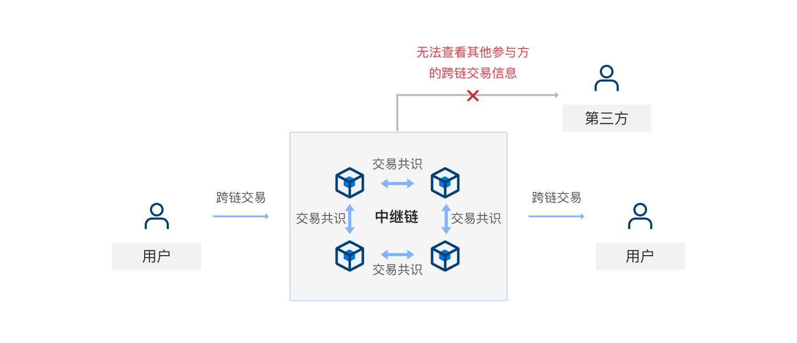
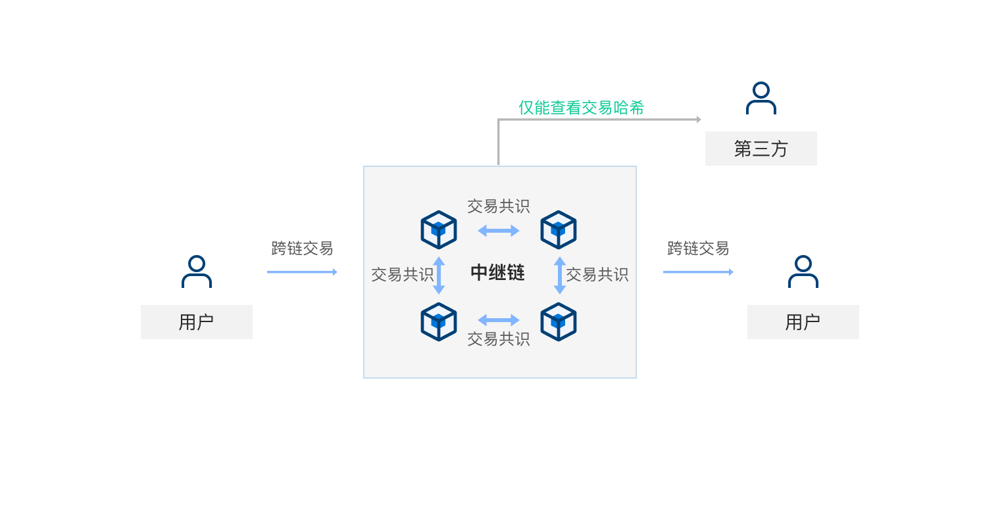
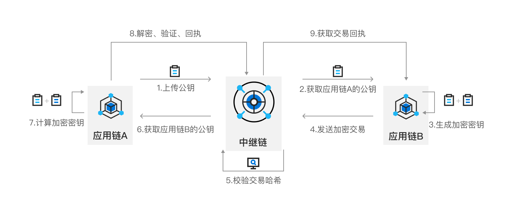

# 隐私保护
## 前提

在跨链场景中，中继链需要记录不同的应用链的跨链请求，所有的跨链交易对于加入了中继链跨链系统的应用链来说都是可见的。这种情况下，如果应用链用户发起的跨链交易带有隐私数据，隐私数据非常容易泄露。

所以我们在中继链的设计中需要隐私保护相关的机制，并且能够保持比较高的灵活度。在跨链系统中，我们提出了两种可行的隐私保护机制。

## 隐私交易

跨链交易在提交到中继链的共识节点之后，会通过共识发送到所有的其他节点去，所以跨链交易对于整个中继链来说没有隐私性可言。而隐私交易这种机制下，收到跨链交易的节点并不会将跨链交易的内容直接进行共识，而是计算跨链交易的哈希值进行共识。跨链交易在共识完成之后，参与方的共识节点将完整的跨链交易直接发送到参与方负责的中继链节点。

这样不相关的节点就无法直接获取到跨链交易，能够保护用户的交易隐私信息。

## 端到端加密

另一种进行隐私保护的思路是在跨链交易提交之前，就对跨链交易进行加密操作。为了提升加解密的效率，采用对称加密和秘钥协商的机制来实现。具体的一次加密交易过程如下图：

要进行加密交易的双方需要在中继链上注册自己的私钥衍生的公钥，这样双方通过自己拥有的私钥和对方注册的公钥，能够计算出一个相同的对称加密的秘钥，用于提交跨链交易之前的加密和获取跨链交易之后的解密。这个秘钥只有公钥的话无法解出用于加密的对称秘钥，所以能够保证跨链交易的隐私性。

