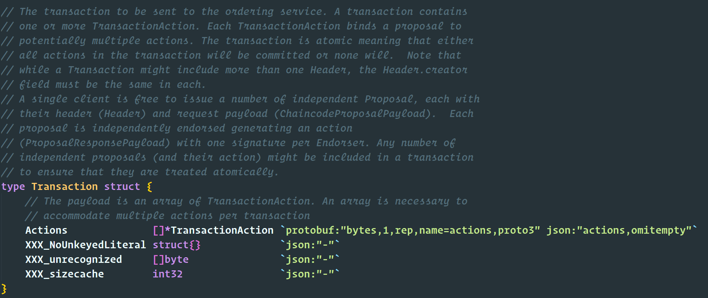
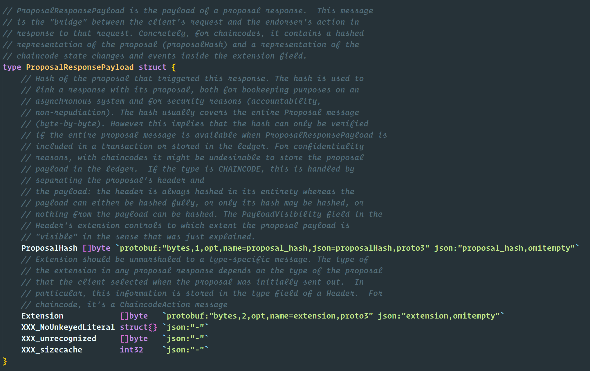
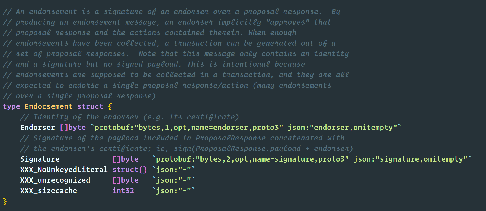
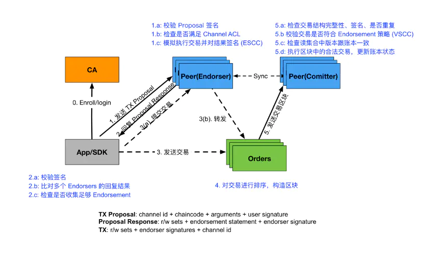
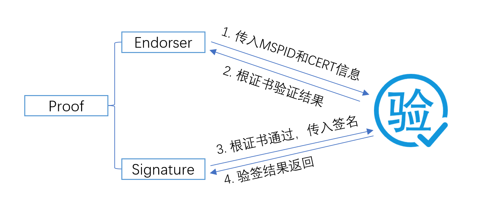

# 验证者信息生成

## 1. 什么是验证者信息

验证者信息是应用链接入中继链后用来验证交易存在性和有效性的重要凭证，常见的验证者信息可以包含应用链背书节点的证书或者公私钥。

应用链的管理员需要根据接入应用链的类型和特性，生成能够验证自己应用链跨链交易的验证者信息，下面我们会以Fabric和Hyperchain为例，介绍如何生成验证者信息。

## 2. Fabric验证者信息的生成

### 2.1 Fabric的验证逻辑

Fabric对于智能合约的执行是在背书节点上进行的，每一个背书节点都会模拟执行chaincode，在模拟执行完chaincode之后，背书节点会对模拟的结果和抛出的事件进行封装，之后再进行签名背书。最后将背书结果发送给客户端。客户端在对比模拟执行的结果之后将背书结果发给orderer节点进行排序，最后在提交阶段会抛出chaincode的事件。

#### 2.1.1 Fabric的存储结构

ProcessedTransaction（位于faric-protos-go->peer->transaction.pb.go）即Fabric存储的已经处理的交易结构。其中包含TransactionEnvelope和ValidationCode两个主要的元素。


| 字段                  | 类型               | 描述              |
| ------------------- | ---------------- | --------------- |
| TransactionEnvelope | *common.Envelope | 交易信封，存储处理过的交易信息 |
| ValidationCode      | int32            | 是否验证            |

Envelop(位于faric-protos-go->common->common.pb.go)即存储在区块中一条交易的数据结构。其中Payload（位于faric-protos-go->common->common.pb.go）通过解析可以分解成Header和Data。


| 字段        | 类型     | 描述                          |
| --------- | ------ | --------------------------- |
| Payload   | []byte | 交易信息的byte数组，可以解析为下面的Payload |
| Signature | []byte |  对Payload的签名                |


| 字段     | 类型      | 描述                  |
| ------ | ------- | ------------------- |
| Header | *Header | 身份信息，防止重复           |
| Data   | []byte  | 可以解析为下面的Transaction |

其中Data则是存储的Transaction（位于faric-protos-go->peer->transaction.pb.go）的信息。一个Transaction可以包含一个或者多个Actions。



| 字段      | 类型                   | 描述                                         |
| ------- | -------------------- | ------------------------------------------ |
| Actions | []*TransactionAction | TransactionAction的数组，TransactionAction结构如下 |


| 字段      | 类型     | 描述                               |
| ------- | ------ | -------------------------------- |
| Header  | []byte | proposal的header                  |
| Payload | []byte | 可以解析成下面的ChaincodeActionPayload结构 |

TransactionAction中的Payload可以解析成ChaincodeActionPayload（位于faric-protos-go->peer->transaction.pb.go）。


| 字段                       | 类型                       | 描述                      |
| ------------------------ | ------------------------ | ----------------------- |
| ChaincodeProposalPayload | []byte                   | 存储chanicode的proposal的信息 |
| Action                   | *ChaincodeEndorsedAction | Chaincode执行结果           |

其中ChaincodeProposalPayload可以解析成ChaincodeProposalPayload（位于aric-protos-go->peer->proposal.pb.go）。

其中Action则是ChaincodeEndorsedAction（位于faric-protos-go->peer->transaction.pb.go）


| 字段                      | 类型             | 描述              |
| ----------------------- | -------------- | --------------- |
| ProposalResponsePayload | []byte         | 存储chaincode执行结果 |
| Endorsements            | []*Endorsement | 背书信息            |

对于ProposalResponsePayload，则可以解析成为ProposalResponsePayload(位于faric-protos-go->peer->proposal_response.pb.go)



对于Endorsements，则是Endorsement的数组，每一个proposal都会有chaincode规定的背书节点们进行签名，Endorsement的结构如下：



#### 2.1.2 Pier获取验证信息

根据上述的交易结构体，Pier可以根据交易的哈希查询到相应的交易，并从结构体中拿到中继链需要验证的Proof字段。

```go
l, err := ledger.New(c.consumer.channelProvider)
		if err != nil {
			return nil, err
		}

		t, err := l.QueryTransaction(response.TransactionID)
		if err != nil {
			return nil, err
		}
		pd := &common.Payload{}
		if err := proto.Unmarshal(t.TransactionEnvelope.Payload, pd); err != nil {
			return nil, err
		}

		pt := &peer.Transaction{}
		if err := proto.Unmarshal(pd.Data, pt); err != nil {
			return nil, err
		}

		return pt.Actions[0].Payload, nil // => this is proof
```

#### 2.1.3 BitXHub验证

BitXHub在接受到Pier发来的跨链的请求时，会解析请求的结构，校验ProposalResponse的签名，并且比对Body的内容是否和ProposalResponse解析出来的一致，如果上面的阶段结果都一致，则代表校验成功。

### 2.2 Fabric的复杂背书

#### 2.2.1 Fabric的背书流程



Fabric的背书目的主要是：

1. 验证 `Endorser` 节点对交易的签名；

1. 验证是否有足够数量的节点对交易背书；

1. 背书信息来自指定源。

#### 2.2.2 实体的定义

一个实体由 MSP 与 ROLE 定义，即某个组织内的某个角色。其中ROLE支持四种 client, peer, admin, member。例如 Org0.admin 表示 Org0 这个 MSP 下的任意管理员; Org1.member 表示 Org1 这个 MSP 下的任意成员。

#### 2.2.3 表达式

`Endorsement Policy` 的语法结构如下所示。`EXPR` 可以是是 `AND` 或者 `OR` 逻辑符。E 是实体或者嵌套的表达式。需要注意的是Fabric暂时只支持1-of-N和MAX-of-N。

```go
// 基础表达式形式
EXPR(E[, E...])
// 需要三个实体都提供签名
AND('Org1.member', 'Org2.member', 'Org3.member')
// 需要两个实体任一提供签名
OR('Org1.member', 'Org2.member')
// 需要Org1的admin提供签名，或者Org2，Org3的member同时提供签名
OR('Org1.admin', AND('Org2.member', 'Org3.member'))
```

#### 2.2.4 验证引擎的验证

验证引擎根据应用链注册时提供的验证名单进行背书验证。Fabric所需要的验证者信息时一个map，key为背书节点的mspid，value为背书节点的跟证书。

可以看到复杂验证规则中有AND和OR的规则，根据Fabric的特性，背书策略在chaincode部署以后可以升级，所以考虑到验证规则的升级，对复杂规则的判断也需要写在合约中。合约中需要对以下几步进行验证。

1. 首先是对签名数量验证，比如对于`AND('Org1.member', 'Org2.member', 'Org3.member')` ，如果背书数组的长度小于3，即可直接驳回。

1. 如果数量对等，则进行逐一校验，需要注意的是拿到endorser的id以后，需要通过key值找到事先存储在BitXHub中的跟证书信息，再对pier发过来的endorser的证书进行验证，比对一致以后再进行验签。



#### 2.2.5 智能合约库

BitXHub提供了背书策略的智能合约库，当部署验证合约时，只要将背书策略的表达式即可完成对背书策略的声明，当一笔跨链交易经过验证引擎时，验证引擎会根据部署的智能合约自动的调用内置的背书策略库，对验证者信息进行核验筛选。

### 2.3. 验证引擎对Fabric的验证流程

#### 2.3.1 应用链注册

应用链在注册到BitXHub时需要提交验证者的信息，在这里我们将Fabric的验证者信息以json的格式提交到BitXHub进行注册。主要分为下面三个字段：

1. 证书信息：证书信息为Fabric的msp信息，包含了机构、成员、角色以及证书的信息。是msp.MSP的数组；

1. 背书策略的byte的数组。通过Fabric的cauthdsl.FromString()函数生成的策略字节数组；

1. chaincode的id，用来验证交易，是由规定的chaincode发出的。

#### 2.3.2 应用链发送跨链交易

应用链会通过IBTP协议发送跨链交易到BitXHub，BitXHub需要对IBTP中的Proof字段进行验证，从而验证跨链交易的有效性。对于Fabric来说Proof字段的内容为交易结构中Transaction.Actions[0].Payload。Pier节点将这个作为Proof字段封装到IBTP然后发送给BitXHub。

#### 2.3.3 验证Proof

验证引擎提供了专门给Fabric的wasm验证库从而简便wasm合约的编写。

1） 首先需要从proof字段中抽取出交易结构，然后对交易结构中的chaincode的id进行校验，只有和注册时表明的chaincode的id相符合才能继续进行验证。

2） 从交易结构中抽取出签名集，签名集是指多个背书节点对proposal背书形成的签名的集合。

3） 将应用链注册时传入的Fabric的msp的配置传入策略生成器，获取可以验证当前应用链的msp的策略验证工具。

4） 将签名集和验证策略传入到策略验证工具进行验证，没有错误即为验证成功。

### 2.4. Fabric验证者信息生成

Fabric验证者信息的生成主要是通过Fabric的验证代码来实现，我们获取了Fabric验证交易所需要的一下信息来为我们验证Fabric跨链交易提供参数信息。

```rust
channelProvider := sdk.ChannelContext(meta.ChannelID, fabsdk.WithUser(meta.Username), fabsdk.WithOrg(meta.ORG))

channelClient, err := channel.New(channelProvider)
if err != nil {
	return nil, fmt.Errorf("create channel fabcli fail: %s\n", err.Error())
}

l, err := ledger.New(channelProvider)
if err != nil {
	return nil, err
}
// Get Fabric Channel Config
conf, err := l.QueryConfig()
if err != nil {
	return nil, err
}
// Generate Policy Bytes
policy, err := cauthdsl.FromString("AND('Org2MSP.peer', 'Org1MSP.peer')")
if err != nil {
	return nil, err
}
pBytes, err := proto.Marshal(policy)
if err != nil {
	return nil, err
}
if err := ioutil.WriteFile("policy", []byte(string(pBytes)), 777); err != nil {
	return nil, err
}
validator := &Validator{
	Cid:     meta.CCID,
	ChainId: "",
	Policy:  string(pBytes),
}
// Generate MSP config bytes
var confStrs []string
for i, value := range conf.MSPs() {
	confStrs = append(confStrs, value.String())
	err := ioutil.WriteFile("conf"+strconv.Itoa(i), []byte(value.String()), 777)
	if err != nil {
		return nil, err
	}
}
validator.ConfByte = confStrs
validatorBytes, err := json.Marshal(validator)
if err != nil {
	return nil, err
}
if err := ioutil.WriteFile("validator", validatorBytes, 777); err != nil {
	return nil, err
}

```

通过上面代码我们可以看出输出的”validator"文件就是我们所需要的Fabric验证者信息

## 3. Hyperchain验证者信息的生成

对于Hyperchain的跨链交易的验证相对于Fabric来说就比较简单了，Hyperchain的交易是由多个节点的多签来确认的，所以我们在构建Hyperchain的验证者信息时可以将参与多签的几个节点的公钥作为数组写入文件中，该文件就是我们所需要的验证者信息。验证规则就是将交易中的多个签名用这个公钥数组组成的验证者信息来进行验证。

## 4. 其他应用链验证者信息的生成

根据上面的两个例子我们可以得出验证者信息生成的核心思想是如何构建能够验证应用链上链交易的凭证，对于其他应用链，应用链管理员只要构建出这样的凭证以及对应的通过该凭证来验证交易的逻辑（即验证规则）就可以将自己的应用链接入到中继链中进行安全有保证的跨链交易了。