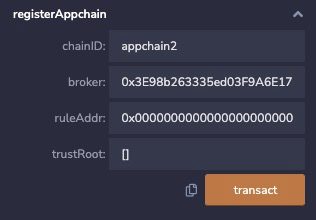
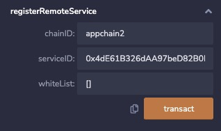

# 直连模式管理
直连模式网关启动教程请参考[跨链网关直连模式部署](/v1.18/bitxhub/usage/direct_mode_pier/pier_direct_mode_deploy/)。

**注意！直连模式应用链注册和服务注册在1.18版本及以后，都是通过合约的方式进行管理**

说明：应用链指的是进行跨链交易的业务链，比如ethereum、bocs、hyperchain等等。服务指的是依托于应用链的业务合约，提供对应的业务服务。参与跨链的最小单元是以服务，所以对应的跨链合约需要对应用链和服务进行管理
## 1. 应用链注册
对于直连模式下需要加入跨链网络应用链，需要首先在broker合约中注册对方应用链应用链的信息，其参数具体如下：
   - `chainID`：与部署broker合约的appchainID一致
   - `broker`：部署的broker合约地址
   - `ruleAddr`：验证规则地址
   - `trustRoot`：应用链信任根，不同的共识算法的信任根的类型不同，对于PoW共识的应用链，`trustRoot`为某一个高度的区块头，对于PoS共识的区块链，`trustRoot`为验证人集合。
例子说明

## 2. 服务注册
同时需要注册对方应用链的服务信息，其具体参数如下：
   - `chainID`：与部署broker合约的appchainID一致
   - `serviceID`：业务合约地址
   - `whiteList`：黑名单，在黑名单内的服务无法调用该服务
例子说明

## 3. 查询服务列表
通过`getLocalServiceList()`与`getRemoteServiceList()`可以查询到自己与对方应用链的serviceID