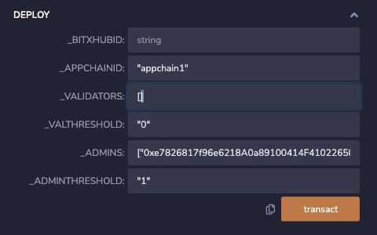
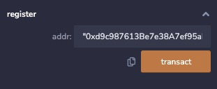
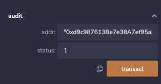

# 跨链网关直连模式部署

跨链网关Pier能够支持跨链消息格式转换、跨链消息的路由、跨链操作的调用等核心功能，不仅保证不同格式的跨链消息能够安全可信的到达目标应用链，而且保证了跨链交易异常情况下来源链的安全。跨链网关为区块链互联形成网络提供了便捷的接入方式，旨在降低跨链互联的使用成本。在之前的文档中介绍了中继模式的pier安装步骤，下面介绍直连模式下pier的安装步骤。请注意，pier直连不依赖于中继链节点，所以本文档不赘述bitxhub的部署了。

## 安装包获取

### 源码安装

跨链网关启动的话需要应用链插件，所以从源码安装的话，还需要编译相应的应用链插件的二进制。

```shell
# 编译跨链网关本身
cd $HOME
git clone https://github.com/meshplus/pier.git
cd pier && git checkout v1.18.0
make prepare && make install

# 编译Fabric
cd $HOME
git clone https://github.com/meshplus/pier-client-fabric.git
cd pier-client-fabric && git checkout v1.18.0
make fabric1.4

# 编译以太坊私链插件
cd $HOME
git clone https://github.com/meshplus/pier-client-ethereum.git
cd pier-client-ethereum && git checkout v1.18.0
make eth

# 插件执行make的编译之后，都会在项目目录的之下的build目录生成相应的二进制文件
```

编译跨链网关步骤会在 $GOPATH/bin 下生成 pier 二进制，运行下面的命令查看是否安装成功：

```shell
# $GOPATH/bin需要在PATH目录下
pier version
```

如果正常安装会打印出类似下面的说明

```text
Pier version: dev-release-1.18-3826f39
App build date: 2022-01-11T14:16:56
System version: linux/amd64
Golang version: go1.14.13
```

### **二进制安装**

没有现有编译环境的用户，也可以在GitHub开源仓库下载编译好的二进制。

- [Pier二进制安装](https://github.com/meshplus/pier/releases)：, 根据需要的版本进行下载即可。
- 网关插件安装：[pier-client-fabric](https://github.com/meshplus/pier-client-fabric/releases) 和 [pier-client-ethereum](https://github.com/meshplus/pier-client-ethereum/releases)  的应用链插件的二进制。

注意：网关与网关插件对应大版本号一致即可。如pier v1.18.x对应pier-client-ethereum v1.18.x。

## 修改配置文件

### 修改pier配置

在进行应用链注册、验证规则部署等步骤之前，需要初始化跨链网关的配置目录

```shell
#以用户目录下的pier为例
pier --repo=~/pier1 init
```

该命令会生成跨链网关的一些基础配置文件模板，使用 tree 命令可查看目录信息：

```text
tree -L 1 ~/.pier1

├── api
├── certs
├── key.json
├── node.priv
└── pier.toml

1 directory, 4 files
```

导入插件二进制（hyperchain的插件二进制和配置文件示例需要内部授权）

```shell
mkdir -p ~/.pier1/plugins
cp fabric-client-1.4 ~/.pier1/plugins
```

pier.toml 文件描述链跨链网关启动的必要配置，具体的配置项和说明如下：

| 配置项     | 说明                             |
| ---------- | --------------------------------|
| [port]     | http、grpc服务端口               |
| [log]      | 日志输出相关设置                 |
| [bitxhub]  | 连接的bitxhub的IP地址、验证人地址 |
| [appchain] | 对接的应用链的基础配置信息        |

主要需要修改的部分是端口信息、中继链的信息、应用链的信息

- 修改端口信息

```toml
[port]
# 如果不冲突的话，可以不用修改
http  = 44544
pprof = 44555
```

- 修改pier配置文件下的api文件信息

```
# 修改为上一步配置的http的端口号
http://localhost:<http port>/v1/
```

- 修改跨链网关信息

```toml
[mode]
type = "direct" # relay or direct
...
...
[mode.direct]
peers = ["/ip4/127.0.0.1/tcp/3003/p2p/QmXfAngyiAkb44ofp1633Ak4nKTKWaBhmQbvE1tsPJzQTX", "/ip4/127.0.0.1/tcp/3004/p2p/QmWLrVrbJxkZxBZsr2UmNEz7eLgCExW6KTax89wDRMXaWw"]
```

**注意：上面peers字段需要配置两方的pier的p2p地址，其中后面那一段是根据pier私钥生成的id，可以使用`pier p2p id `命令来获取，这也是直连模式区别于中继模式的关键配置。**

- 修改应用链信息

```toml
[appchain]
# 所连接的应用链的配置文件夹在跨链网关配置文件夹下的相对路径
config = "fabric"
# 应用链ID
id = "fabappchain"
# 所连接的应用链对应的Plugin文件在跨链网关配置文件夹下的相对路径
plugin = "fabric-client-1.4"
```

网关pier适配以太坊插件的配置仿照上述步骤即可。

### 修改fabric插件配置

Fabric插件配置的模板在`pier-client-fabric`项目中，并且已经在GitHub上进行开源，所以直接在GitHub上下载代码即可

```shell
# 转到pier-client-fabric项目路径下
git clone https://github.com/meshplus/pier-client-fabric.git 
cd pier-client-fabric && git checkout v1.18.0
cp ./config $HOME/.pier1/fabric
```

配置目录结构

```text
├── crypto-config/
├── config.yaml
├── fabric.toml
└── fabric.validators
```

主要修改Fabric网络配置，验证证书，跨链合约设置：

- **Fabric证书配置**

  启动Fabric网络时，会生成所有节点（包括Order、peer等）的证书信息，并保存在 crypto-config文件夹中，Fabric插件和Fabric交互时需要用到这些证书。

  ```shell
  # 复制你所部署的Fabric所产生的crypto-config文件夹
  cp -r /path/to/crypto-config $HOME/.pier1/fabric/
  
  # 复制Fabric上验证人证书
  cp $HOME/.pier1/fabric/crypto-config/peerOrganizations/org2.example.com/peers/peer1.org2.example.com/msp/signcerts/peer1.org2.example.com-cert.pem $HOME/.pier1/fabric/fabric.validators
  ```

- **修改Plugin配置文件 config.yaml**

  `config.yaml`文件记录的Fabric网络配置（如果你是按照你自己的网络拓扑部署的Fabric，用你的网络拓扑配置文件替换这个样例文件），需要使用绝对路径，把所有的路径都修改为 `crypto-config`文件夹所在的绝对路径，$USER指代当前用户名

  ```yaml
  path: {CONFIG_PATH}/fabric/crypto-config => path: /home/$USER/.pier/fabric/crypto-config
  ```

  替换为你部署的Fabric网络的拓扑设置文件即可，同时需要修改所有的Fabric 的IP地址，如：

  ```yaml
  url: grpcs://localhost:7050 => url: grpcs://10.1.16.48:7050
  ```

- **修改Plugin配置文件 fabric.toml**

  配置项和说明：

  | 配置项       | 说明                                |
  | ------------ | ----------------------------------- |
  | addr         | Fabric 区块链所在的服务器地址和端口 |
  | event_filter | 跨链合约中抛出的跨链事件的名称      |
  | username     | Fabric用户名称                      |
  | ccid         | 所部署的跨链合约名称                |
  | channel_id   | 部署的跨链合约所在的channel         |
  | org          | 部署的跨链合约所在的org             |

  示例配置

  ```toml
  addr = "localhost:7053" // 若Fabric部署在服务器上，该为服务器地址
  event_filter = "interchain-event-name"
  username = "Admin"
  ccid = "broker" // 若部署跨链broker合约名字不是broker需要修改
  channel_id = "mychannel"
  org = "org2"
  ```

- **修改Plugin配置文件fabric.validators**

  fabric.validators 是Fabric验证人的证书，配置示例：

  ```
  -----BEGIN CERTIFICATE-----
  MIICKTCCAc+gAwIBAgIRAIBO31aZaSZoEYSy2AJuhJcwCgYIKoZIzj0EAwIwczEL
  MAkGA1UEBhMCVVMxEzARBgNVBAgTCkNhbGlmb3JuaWExFjAUBgNVBAcTDVNhbiBG
  cmFuY2lzY28xGTAXBgNVBAoTEG9yZzIuZXhhbXBsZS5jb20xHDAaBgNVBAMTE2Nh
  Lm9yZzIuZXhhbXBsZS5jb20wHhcNMjAwMjA1MDgyMjAwWhcNMzAwMjAyMDgyMjAw
  WjBqMQswCQYDVQQGEwJVUzETMBEGA1UECBMKQ2FsaWZvcm5pYTEWMBQGA1UEBxMN
  U2FuIEZyYW5jaXNjbzENMAsGA1UECxMEcGVlcjEfMB0GA1UEAxMWcGVlcjEub3Jn
  Mi5leGFtcGxlLmNvbTBZMBMGByqGSM49AgEGCCqGSM49AwEHA0IABG3jszFPTbGm
  dAYg2BxmHMTDKfQReNw3p9ttMK130qF5lQo5zLBG8Sa3viOCLnvjjg6A/P+yKnwv
  isI/jEVE8T2jTTBLMA4GA1UdDwEB/wQEAwIHgDAMBgNVHRMBAf8EAjAAMCsGA1Ud
  IwQkMCKAIMVL+daK7nMGr2/AQIXTSPFkdd3UiPVDkWtkh5ujnalEMAoGCCqGSM49
  BAMCA0gAMEUCIQDMYOQiYeMiQZTxlRkj/3/jjYvwwdCcX5AWuFmraiHkugIgFkX/
  6uiTSD0lz8P+wwlLf24cIABq2aZyi8q4gj0YfwA=
  -----END CERTIFICATE-----
  ```

### 修改ethereum插件配置

ethereum插件配置的模板在`pier-client-ethereum`项目中，并且已经在GitHub上进行开源，所以直接在GitHub上下载代码即可

```shell
# 转到pier-client-ethereum项目路径下
git clone https://github.com/meshplus/pier-client-ethereum.git 
cd pier-client-ethereum && git checkout v1.18.0
cp ./config $HOME/.pier2/ether
```

配置目录结构

```text
├── account.key
├── broker.abi
├── data_swapper.abi
├── ether.validators
├── ethereum.toml
├── password
├── pier.toml // 仅作参考，无需配置
├── transfer.abi
└── validating.wasm
```

**注意：**插件目录下的pier.toml仅作参考，系统使用的配置文件是位于pier的配置文件目录下的pier.toml。

主要修改账户信息、abi，跨链合约设置。

- **以太坊账户配置**

  启动以太坊网络时，在指定的`datadir`目录下，将`keystore`的账户信息拷贝到account.key中。

  ```
  cp <eth_datadir>/keystore/<account> $HOME/.pier2/ether/config/account.key
  ```

- **修改Plugin配置文件ethereum.toml**

  配置项和说明：

  | 配置项           | 说明                                 |
  | ---------------- | ------------------------------------|
  | addr             | ethereum 区块链所在的服务器地址和端口 |
  | name             | 以太坊链名称                          |
  | contract_address | 部署的broker合约地址                  |
  | key_path         | 账户信息文件路径                      |
  | password         | 账户密码文件路径                      |
  | min_confirm      | 最低确认区块数                        |
  | timeout_height   | 超时回滚的区块数                       |

  示例配置

  ```toml
  [ether]
  addr = "ws://localhost:8546"
  name = "ether"
  contract_address = "0x09f0a8c66bc8bC6e29bF0A425CDD7aa133F40571"
  key_path = "account.key"
  password = "password"
  min_confirm = 1
  timeout_height = 100
  ```
## 启动程序

准备工作：
1. 两条应用链上A和B都部署broker合约和业务合约transfer和dataSwapper
  - 部署broker合约时需要指定应用链的chainID、admin，将Validator置为空等，admin为自己的账户地址。
  - 部署业务合约时，需要在address输入对应的broker合约地址
配置如下所示：

```text
"","appchain1",[],"0",["0xe7826817f96e6218A0a89100414F41022650c537"],"1"
"","appchain2",[],"0",["0xe7826817f96e6218A0a89100414F41022650c537"],"1"
```

2. 本链业务合约注册到broker合约并审核通过
  - `register`: 在本链的业务合约注册到本链的broker合约（addr为本连链业务合约地址）
  
  - `audit` : Admin管理员审核通过
  
3. 本链注册对方应用链和服务
  应用链和服务的注册的流程参照直连模式下[应用链管理](../../function/direct_manager/)
4. 启动跨链网关

```shell
#以用户目录下的pier1为例
pier --repo=~/pier1 start

#以用户目录下的pier2为例
pier --repo=~/pier2 start
```

观察日志信息没有报错信息，pier启动成功

**说明：1. 因为跨链合约和验证规则的部署涉及到不同应用链的细节，且需依赖应用链的安装部署，具体操作请见快速开始手册或使用文档，这里不再赘述。2. 本文是以一方的跨链网关为例进行部署，而另一方的跨链网关的部署与之基本一样，这里不再赘述。**

直连模式下，两边的跨链网关对应

完成上述布置后，跨链网关直连模式下部署就已经完成，两边的应用链可以进行跨链操作

