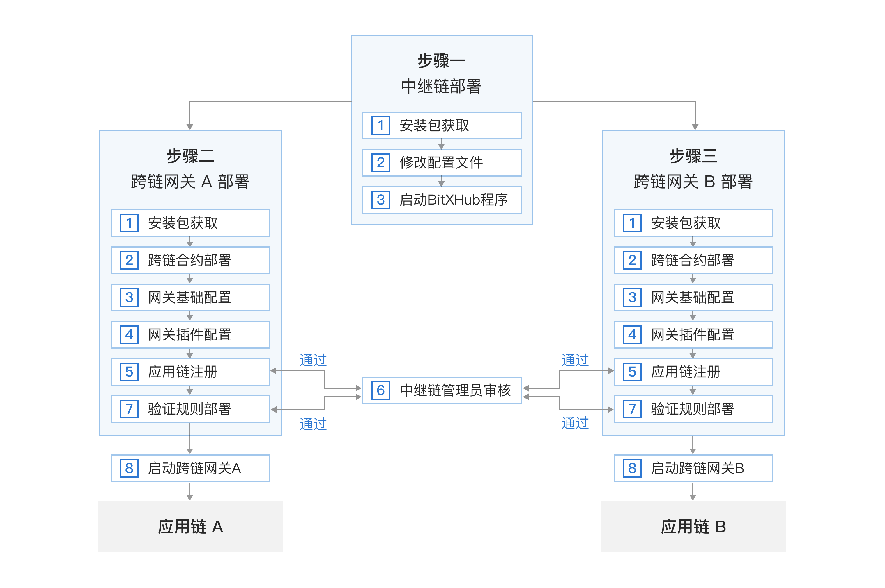

# 整体说明

这篇文档是对BitXHub跨链系统部署的整体说明，主要是介绍BitXHub跨链系统的一般部署流程和部署架构。

## 1. 环境准备

环境准备是部署和使用BitXHub跨链平台的第一步，主要是说明BitXHub及相关组件运行的硬件配置和软件依赖，您需要在部署BitXHub平台之前确认服务器满足硬件和软是否件的要求，具体信息请查看[环境准备](./env.md)文档。

## 2. 单中继链部署架构

一般来说，单中继链架构适用于大多数部署场景，建议您使用此种部署架构来体验BitXHub跨链系统。如下图所示，部署完bitxhub节点集群（也可以是solo模式的单机节点），两条或多条应用链上部署好跨链合约，然后通过各自的跨链网关接入到中继链中，完成跨链系统的搭建。

在明晰了部署架构之后，这里再说明下部署的一般流程：

1. 首先需要部署BitXHub中继链节点，这是搭建跨链系统的基础，可以参考单中继链部署架构目录下的[中继链部署](./single_bitxhub/deploy_bitxhub.md)文档；
2. 然后是部署Pier跨链网关节点，这是接入应用链的必要组件，其中重要的流程有跨链合约部署、网关/插件的配置修改、应用链注册和验证规则部署，可以参考单中继链部署架构目录下的[跨链网关部署](./single_bitxhub/deploy_pier.md)文档。

## 3. 跨链网关直连部署架构

跨链网关直连部署架构是指不使用中继链，两方的应用链通过跨链网关与对方直接连接，部署结构如下图所示，除了无需部署中继链节点之外，部署的流程与上一章基本一致，具体的部署流程可以参考[跨链网关直连模式部署](./direct_mode_pier/pier_direct_mode_deploy.md)文档。

