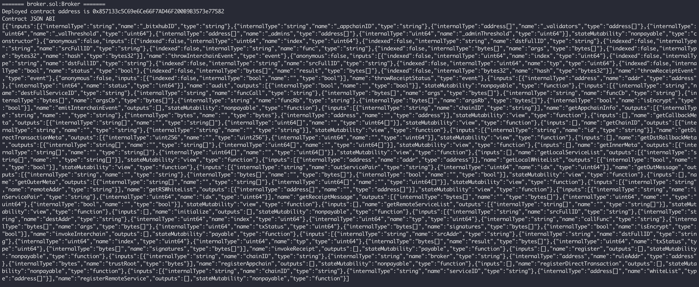

# 合约部署
合约部署主要指的是针对BitXHub进行跨链交易所需的**跨链管理合约**和**业务合约**的部署。目前我们支持的合约主要以以太坊为典型的solitidy合约和fabric的go合约。部署合约的方法有很多，针对solitidy合约你可以通过[remix](http://remix.ethereum.org)进行部署,同样fabric的合约你可以通过fabric-cli部署。本文主要介绍以如何通过[goduck](../../../../goduck/)这个工具进行相关的合约部署和调用

=== "Ethereum"

    Step1: 获取goduck工具
    ```shell
    git clone https://github.com/meshplus/goduck.git 
    cd goduck && make install
    # 初始化goduck配置
    goduck init
    ```

    Step2: 获取部署合约

    合约文件可以在[pier-client-ethereum项目](https://github.com/meshplus/pier-client-ethereum/blob/v2.0.0/example)的exampe文件夹中获取。合约文件就在项目的example目录下，broker.sol是跨链管理合约，transfer.sol是示例业务合约

    Step3: 部署broker跨链管理合约
    ```shell
    # address指定以太坊地址
    # key-path指定以太坊账户地址的私钥，goduck使用该账户进行合约部署，所以需要保证该账户有足够的gas费进行合约部署
    # psd-path指定以太坊账户地址私钥的密码
    # code-path指定broker合约地址
    # 注意!!!由于goduck采用远程编译的方式进行，需要确保以太坊所在服务器有对应的solitidy编译环境
    goduck ether contract deploy \
    --address http://localhost:8545 \
    --key-path account.key \
    --psd-path password --code-path broker.sol \
    "1356"^"ethappchain"^["0xc7F999b83Af6DF9e67d0a37Ee7e900bF38b3D013","0x79a1215469FaB6f9c63c1816b45183AD3624bE34","0x97c8B516D19edBf575D72a172Af7F418BE498C37","0xc0Ff2e0b3189132D815b8eb325bE17285AC898f8"]^"3"^["0x20f7fac801c5fc3f7e20cfbadaa1cdb33d818fa3"]^"1"
    # 部署broker合约需要有相关的构造参数，即"1356..."这些构造参数，这些构造参数通过"^"进行分割，具体参数含义可以参考broker合约的说明
    ```
    

    Step4: 部署transfer业务合约
    ```shell
    goduck ether contract deploy \
    --address http://localhost:8545 \
    --key-path account.key \
    --psd-path password --code-path transfer.sol \
    "0x857133c5C69e6Ce66F7AD46F200B9B3573e77582"
    # 部署transfer合约需要有相关的  构造参数，即"0x857133c5C69e6Ce66F7AD46F200B9B3573e77582"，该参数是broker合约的地址
    ```
    

    Step5: broker合约审计transfer合约
    ```shell
    # abi-path指定abi文件
    goduck ether contract invoke \
    --address http://localhost:8545 \
    --key-path account.key \
    --psd-path password \
    --abi-path broker.abi
    "0x857133c5C69e6Ce66F7AD46F200B9B3573e77582" audit "0x30c5D3aeb4681af4D13384DBc2a717C51cb1cc11"^"1" 
    # 调用合约需要提供合约地址，即"0x30c5D3aeb4681af4D13384DBc2a717C51cb1cc11"，1代表审核通过，0代表审核不通过,只有审核通过的业务合约才能参与跨链交易
    ```

=== "Fabric"

    Step1: 获取goduck工具
    ```shell
    git clone https://github.com/meshplus/goduck.git 
    cd goduck && make install
    # 初始化goduck配置
    goduck init
    ```

    Step2: 获取部署合约

    合约文件可以在[pier-client-fabric项目](https://github.com/meshplus/pier-client-fabric/blob/v2.0.0/example)的exampe文件夹中获取。合约文件就在项目的example目录下，broker是跨链管理合约，transfer是示例业务合约

    Step3: 部署broker跨链管理合约
    ```shell
    # config-path指定fabric配置文件路径
    # gopath指定fabric合约路径
    # ccp指定fabric chaincode路径
    # ccid指定fabric chaincode id
    # version指定fabric chaincode版本
    # 注意！！！config.yaml如果使用的变量，需要指定具体的证书路径
    goduck fabric deploy \
    --config-path config.yaml \
    --gopath contracts
    --ccp broker \
    --ccid broker \
    --version 1
    ```
    
    
    Step4: 初始化broker合约
    ```shell
    goduck fabric contract invoke --config-path config.yaml broker initialize 1356,fabappchain
    # 初始化broker合约需要提供BitXHub的chainId，以及对应应用链的ID
    ```

    Step5: 部署transfer业务合约
    ```shell
    goduck fabric deploy \
    --config-path config.yaml \
    --gopath contracts
    --ccp transfer \
    --ccid transfer \
    --version 1
    ```
    

    Step6: transfer合约向broker合约发起注册
    ```shell
    goduck fabric contract invoke --config-path config.yaml transfer register
    ```

    Step7: broker合约审计transfer合约
    ```shell
    goduck fabric contract invoke --config-path config.yaml broker audit mychannel,transfer,1
    ```
    